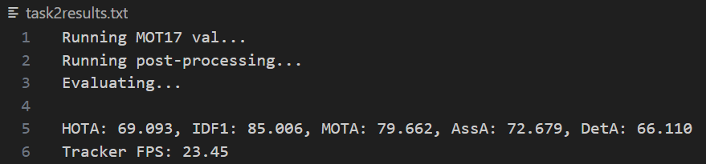

# Multi-Object-Tracking

This repo is forked from [TrackTrack](https://github.com/kamkyu94/TrackTrack) for the Lauretta.io Intern Take Home Assignment.

## Setup Instructions

### 1. Clone this repository

```bash
git clone https://github.com/Razan1412/Multi-Object-Tracking.git
cd Multi-Object-Tracking
```

### 2. Set up the environment

If conda is available, simply create the environment based on the yml file:

```bash
conda env create -f environment.yml
conda activate mot-env
```

Alternatively, you may directly install the requirements in your own Python 3.9 environment.

```bash
pip install -r requirements.txt
```

### 3. Dataset Preparation

Download the [MOT17 Dataset](https://motchallenge.net/data/MOT17.zip) and place the extracted dataset in the `dataset/` directory.

### 4. YOLOX Setup

Download [mot17_half.pth.tar](https://drive.google.com/file/d/1R-eMf5SgwmizMkOjqJq3ZiurWBNGYf1j/view?usp=drive_link) and place it (as a .tar folder) in `Multi-Object-Tracking/1. YOLOX/weights`.

### 5. FastReID Setup

Download [mot17_half_sbs_S50.pth](https://drive.google.com/file/d/1kTG7mVNhYGicR0IXZ0Y1rebVoBRfOMGY/view?usp=drive_link) and place it in `Multi-Object-Tracking/2. FastReID/weights`.

### Expected Directory Structure:

After completing setup steps, your project (relevant files) should look like this:

```
Multi-Object-Tracking/

├── 1. YOLOX/
│   └── weights/
│       └── mot17_half.pth.tar
├── 2. FastReID/
│   └── weights/
│       └── mot17_half_sbs_S50.pth
├── dataset/
│   └── MOT17/
│       ├── train/
│       └── test/
```

## Execution Instructions

All scripts are run from the `Multi-Object-Tracking` directory. Ensure a GPU is available.

### Task 2: Baseline reproduction

```bash
./task2.sh
```

### Task 3: RF-DETR detector integration

```bash
./task3.sh
```

### Task 4: RF-DETR Detector + Deep-Person-ReID (torchreid) Feature Extractor

```bash
./task4.sh
```

## Results

### Task 2 – Baseline reproduction:

- Achieved highest HOTA of **69.093**.



### Task 3 – RF-DETR detector integration:

- Achieved highest HOTA of **24.817**.


### Task 4 – RF-DETR Detector + Deep-Person-ReID (torchreid) Feature Extractor:

- Achieved highest HOTA of **23.815**.

## 

## Original README from [TrackTrack](https://github.com/kamkyu94/TrackTrack)

# TrackTrack

[](https://paperswithcode.com/sota/multi-object-tracking-on-mot17?p=focusing-on-tracks-for-online-multi-object)<br>
[](https://paperswithcode.com/sota/multi-object-tracking-on-mot20-1?p=focusing-on-tracks-for-online-multi-object)<br>
[](https://paperswithcode.com/sota/multi-object-tracking-on-dancetrack?p=focusing-on-tracks-for-online-multi-object)<br>

Official code for "Focusing on Tracks for Online Multi-Object Tracking", CVPR, 2025

- https://openaccess.thecvf.com/content/CVPR2025/html/Shim_Focusing_on_Tracks_for_Online_Multi-Object_Tracking_CVPR_2025_paper.html

## Environment

Developed in python3.8, pytorch 1.13

## Prepare

**1. Downlodad datasets**

- MOT17: https://motchallenge.net/data/MOT17.zip
- MOT20: https://motchallenge.net/data/MOT20.zip
- DanceTrack: https://dancetrack.github.io/

<br />

**2. Locate codes and datasets as below**

```
- workspace
  - code
    - 1. YOLOX
    - 2. FastReID
    - 3. Tracker
  - dataset
    - MOT17
    - MOT20
    - DanceTrack
```

<br />

**3. Run**

```
run 1. YOLOX
run 2. FastReID
run 3. Tracker
```

## Results


